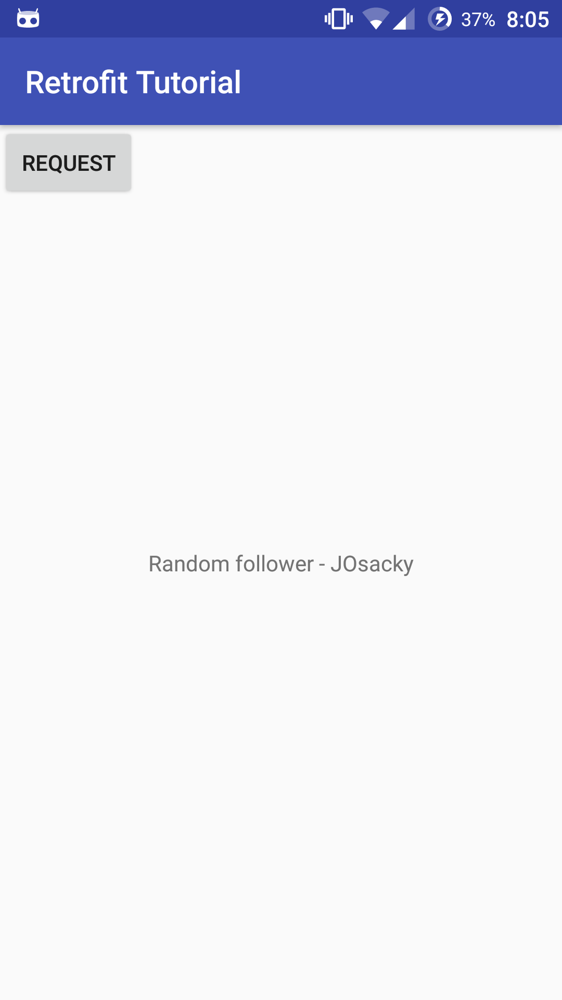

# GitHub Profile Finder — Android + Retrofit 2

A small Android app that looks up any GitHub user by username and displays their profile (avatar, bio, location, follower / following / repo counts) in a polished Material-themed UI. Built as a practical example of [Retrofit 2](http://square.github.io/retrofit/), Android's go-to type-safe HTTP client.

## Features

- Search any GitHub username
- Avatar loaded with **Glide** (circular crop)
- Profile card with name, `@login`, bio, and location
- Stats row: followers / following / public repos (auto-formatted as `1.2k`, `3.4M`, etc.)
- "Open on GitHub" button that launches the profile in a browser
- Loading spinner, empty state, and friendly error states (`404` → user-not-found, network failure → connectivity hint)
- Keyboard `Search` action triggers the request
- Material 3 themed UI on a purple gradient background

## Tech stack

| Layer            | Library / version                  |
|------------------|------------------------------------|
| Build            | Gradle 8.7, AGP 8.5.0              |
| Language         | Java 17                            |
| Min / Target SDK | 21 / 34                            |
| UI               | AndroidX AppCompat, Material 1.12, ConstraintLayout |
| Networking       | Retrofit 2.11.0 + Gson converter   |
| Image loading    | Glide 4.16.0                       |

## Project structure

```
app/src/main/java/gg/krish/retrofittutorial/
├── MainActivity.java   // UI wiring, search action, render profile
├── GitHubApi.java      // Retrofit interface + singleton Retrofit instance
└── UserModel.java      // Gson-mapped model for /users/{user}
```

## Running

1. Open the project in **Android Studio Hedgehog (or newer)**.
2. **File → Sync Project with Gradle Files** — first sync downloads Gradle 8.7.
3. **Run ▶** on an emulator or device (API 21+).

That's it. The input defaults to `octocat` so you can verify the round-trip immediately.

## How it works

### 1. The model (`UserModel.java`)

Gson maps JSON fields from `https://api.github.com/users/{username}` into Java fields. `@SerializedName` lets us use idiomatic camelCase Java names while still binding to GitHub's snake_case JSON:

```java
@SerializedName("avatar_url")   private String avatarUrl;
@SerializedName("html_url")     private String htmlUrl;
@SerializedName("followers")    private int followers;
@SerializedName("public_repos") private int publicRepos;
```

### 2. The API interface (`GitHubApi.java`)

Retrofit turns this interface into a real implementation at runtime — no boilerplate `HttpURLConnection` code.

```java
public interface GitHubApi {
    @GET("users/{user}")
    Call<UserModel> loadUser(@Path("user") String user);

    Retrofit retrofit = new Retrofit.Builder()
            .baseUrl("https://api.github.com/")
            .addConverterFactory(GsonConverterFactory.create())
            .build();
}
```

### 3. Making the call (`MainActivity.java`)

`enqueue()` runs the request off the main thread and delivers the result back on the UI thread, so we can update views directly inside `onResponse`:

```java
api.loadUser(username).enqueue(new Callback<UserModel>() {
    @Override
    public void onResponse(Call<UserModel> call, Response<UserModel> response) {
        progress.setVisibility(View.GONE);
        if (response.isSuccessful() && response.body() != null) {
            bind(response.body());
        } else {
            showError(response.code() == 404
                    ? getString(R.string.error_not_found)
                    : getString(R.string.error_generic));
        }
    }

    @Override
    public void onFailure(Call<UserModel> call, Throwable t) {
        progress.setVisibility(View.GONE);
        showError(getString(R.string.error_generic));
    }
});
```

### 4. Permissions

`AndroidManifest.xml` declares internet access — required for any network call:

```xml
<uses-permission android:name="android.permission.INTERNET" />
```

## Dependencies

Defined in `app/build.gradle`:

```gradle
implementation 'androidx.appcompat:appcompat:1.7.0'
implementation 'androidx.constraintlayout:constraintlayout:2.1.4'
implementation 'com.google.android.material:material:1.12.0'

implementation 'com.squareup.retrofit2:retrofit:2.11.0'
implementation 'com.squareup.retrofit2:converter-gson:2.11.0'

implementation 'com.github.bumptech.glide:glide:4.16.0'
```

## Notes

- The public GitHub API is rate-limited to **60 requests/hour** for unauthenticated clients. If you're hammering it during development, expect `403` responses — they'll surface as the generic error state.
- The app intentionally has no authentication layer; adding a personal access token via an `Authorization` interceptor would lift the rate limit to 5,000/hour.

## Screenshot



*(Older screenshot from the original follower-list version — the current UI shows a single profile card.)*
